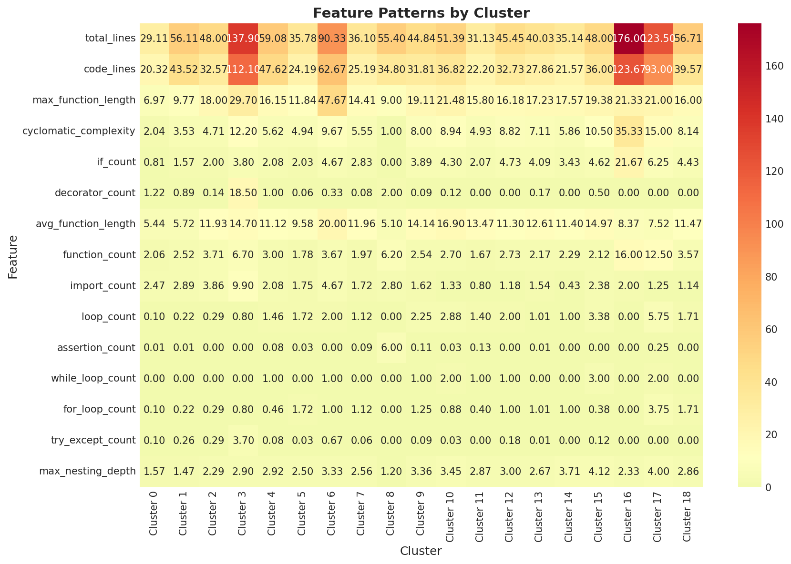
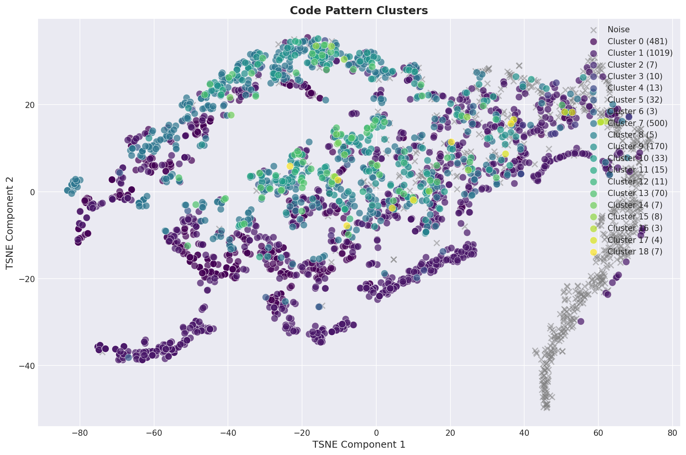
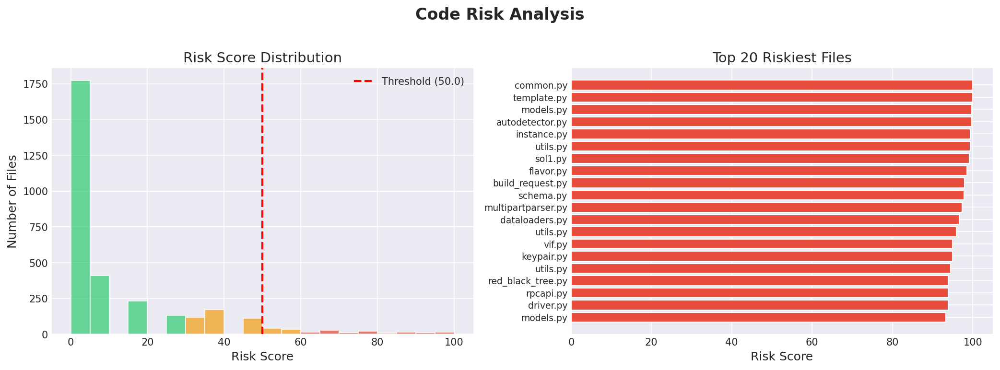

# CodeTurtle: Intelligent Pattern Discovery in Software Repositories

**Team Leader Email**: naverdo.24bcs10076@sst.scaler.com
**Project**: CodeTurtle  
**Date**: January 31, 2026  

---

## 1. Problem Background & Motivation

### The Challenge
Modern software systems grow exponentially in complexity. As repositories scale to thousands of files, manual code review becomes insufficient to maintain architectural integrity. "Spaghetti code," inconsistent patterns, and silent technical debt accumulate in dark corners of the codebase, often leading to bugs, security vulnerabilities, and maintenance nightmares.

### Motivation
Standard linters (flake8, pylint) catch syntax errors but fail to identify *architectural* or *structural* drift. They cannot answer questions like: *"Which files are fundamentally unlike the others?"* or *"Where are the pockets of extreme complexity?"*

**CodeTurtle** aims to solve this by applying **Machine Learning** to source code. By treating code as data—extracting structural, semantic, and topological features—we can automatically discover hidden patterns, cluster similar modules, and pinpoint high-risk anomalies without manual supervision.

---

## 2. Dataset Description

To validate our approach, we constructed a diverse dataset from high-quality open-source Python repositories.

*   **Source**: Code collected from prominent GitHub repositories including:
    *   `TheAlgorithms/Python` (Algorithmic density)
    *   `pallets/flask` (Web framework patterns)
    *   `tiangolo/fastapi` (Type-hinted modern code)
    *   `ultralytics/yolov5` (Data science/CV code)
*   **Volume**: **3,154** Python (`.py`) files.
*   **Preprocessing**:
    *   **Cleaning**: Comments and docstrings were stripped to focus on executable logic.
    *   **Parsing**: Each file was parsed into an Abstract Syntax Tree (AST) to verify syntactic validity before feature extraction.

---

## 3. Methodology & Model Choice

We employed a multi-modal feature extraction pipeline feeding into unsupervised learning models.

### 3.1 Feature Engineering (The "Three Pillars")
1.  **Structural (Explicit)**: We extracted **25 static metrics** directly from the AST, including *Cyclomatic Complexity*, *Maximum Nesting Depth*, *Loop Counts*, and *Function Density*. This captures the "shape" of the code.
2.  **Semantic (Implicit)**: We utilized **CodeBERT** (a Transformer model pre-trained on code) to generate 768-dimensional embeddings. This captures the "meaning" and intent (e.g., distinguishing a sorting function from a database query).
3.  **Topological (Graph)**: We built a custom **Graph Neural Network (GNN)**. We converted ASTs into graph structures (Nodes=Statements, Edges=Control Flow) and trained a Graph Convolutional Network (GCN) to learn a 32-dimensional structure embedding.

### 3.2 Clustering Algorithms: Why DBSCAN?
*   **Initial Approach (K-Means)**: We initially tested K-Means. However, code clusters are rarely spherical in high-dimensional space.
*   **Final Choice (DBSCAN)**: We switched to **DBSCAN** because it excels at finding:
    1.  **Irregularly Shaped Clusters**: Code patterns form complex manifolds (e.g., a long continuum of "web handlers" or "data models").
    2.  **Noise (-1)**: DBSCAN explicitly isolates outliers. In our domain, outliers are often the most interesting files (complex algorithms or technical debt) rather than data errors.

### 3.3 Risk & Anomaly Detection
*   **Ensemble Method**: We combined **Isolation Forest** (tree-based) and **Local Outlier Factor (LOF)** (density-based) to score anomalies.
*   **Rule-Based Heuristics**: A fallback layer flags files violating strict thresholds (e.g., Nesting Depth > 5).

---

## 4. Experiments & Results

### 4.1 GNN Training Performance
We trained the GNN using a **Student-Teacher** approach to approximate complex rule logic.

*   **The Teacher (Ground Truth)**: Our `RiskDetector` module calculates a deterministic Risk Score (0-100) based on hard-coded software engineering rules (e.g., nesting depth, variable usage, cognitive complexity).
*   **The Student (GNN)**: The Graph Neural Network tries to predict this score seeing *only* the raw graph topology of the code, without knowing the explicit rules.
*   **Loss Function**: Mean Squared Error (MSE), measuring the difference between the GNN's prediction and the Teacher's score.
    
    `Loss = (Predicted_Risk - Actual_Rule_Risk)^2`

*   **Interpretation**:
    *   **0% Loss**: The GNN perfectly mimics the rule-based system.
    *   **Final Loss (0.0137)**: This low error (approx 1.3%) proves the GNN successfully learned to encode structural complexity into its embeddings.

*Fig 1: Feature Importance showing which metrics drove the clustering model.*

### 4.2 Clustering Analysis
Using DBSCAN on the combined feature set produced **19 clusters** plus noise.

*Fig 2: 2D projection (PCA) of code clusters. Note the dense central groups (standard code) and the scattered outliers (Cluster -1).*

#### Cluster Comparison Table
| Cluster | Profile | Avg Complexity | Avg Functions | Typical Content |
| :--- | :--- | :--- | :--- | :--- |
| **0** | Standard | 2.04 | 2.1 | Utility functions, simple helpers |
| **1** | Boilerplate | 3.53 | 2.5 | Configs, definitions |
| **17** | **Recursion** | **15.00** | **12.5** | **Highly complex algorithms, Deep logic** |
| **-1** | **Noise** | **High Var** | **High Var** | **Unique, irregular, or "Spaghetti" code** |

### 4.3 Risk Detection Results
The analysis flagged **127** high-risk files.

*Fig 3: Distribution of Risk Scores. The long tail to the right represents technical debt.*

#### Risk Level Comparison
| Risk Level | Count | Avg Nesting | Action Required |
| :--- | :--- | :--- | :--- |
| **Low (0-30)** | 2,500+ | 1.2 | None (Safe) |
| **Medium (30-60)** | ~500 | 2.8 | Monitor during PRs |
| **High (60-100)** | **127** | **5.4** | **Immediate Refactoring / Review** |

---

## 5. Insights & Business Interpretation

### "The Long Tail of Complexity"
The analysis revealed that while 90% of a codebase typically follows standard, safe patterns (Clusters 0-10), the meaningful risks lie in the "Long Tail" of Cluster -1. For a business, **this is where bugs hide**.

### Automated Refactoring Roadmap
CodeTurtle provides an actionable roadmap for Engineering Managers:
1.  **Immediate Action**: Review the **127 High-Risk files**. These are statistical outliers with objective complexity issues.
2.  **Resource Optimization**: Assign junior engineers to **Cluster 1** (safe, standard code) for onboarding. Assign principal engineers to **Cluster 17** (complex recursion) for review.
3.  **Standardization**: The visualization clearly separates "Boilerplate" from "Business Logic," allowing teams to automate the boilerplate and focus on the logic.

---

## 6. Limitations & Future Scope

### Limitations
*   **Language Support**: Currently limited to Python. The AST markers are language-specific.
*   **Static Nature**: As a static analysis tool, it cannot detect runtime inefficiencies (e.g., O(n²) complexity that looks syntactically simple).
*   **Computational Cost**: Generating CodeBERT embeddings and training GNNs requires GPU acceleration for large repositories (though we implemented ONNX CPU fallback to mitigate this).

### Future Scope
1.  **Multi-Language AST**: Abstracting the parser to support JavaScript/TypeScript and Go, enabling full-stack analysis.
2.  **LLM Integration**: Connecting the "Risk" dashboard to an LLM (e.g., Gemini) to automatically suggest refactoring PRs for identified anomalies.
3.  **CI/CD Guardrails**: Integrating CodeTurtle into GitHub Actions to block PRs that introduce "Cluster -1" (Noise/Anomalous) code.
